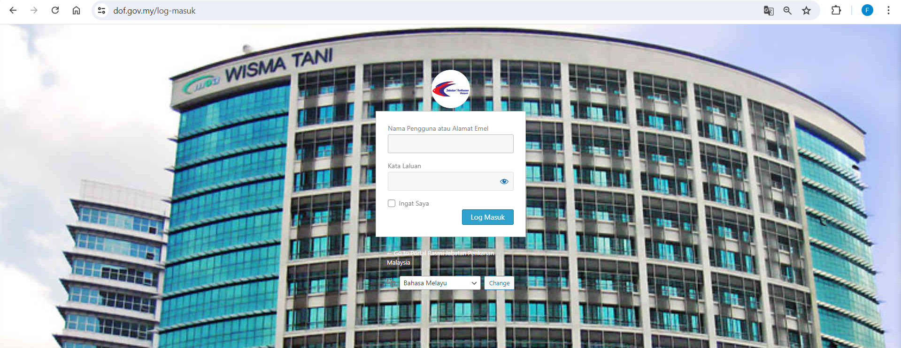

# Managing the Department of Fisheries Malaysia WordPress CMS

## Table of Contents

- [Managing the Department of Fisheries Malaysia WordPress CMS](#managing-the-department-of-fisheries-malaysia-wordpress-cms)
  - [Table of Contents](#table-of-contents)
  - [Introduction](#introduction)
  - [Accessing the WordPress Dashboard](#accessing-the-wordpress-dashboard)
  - [Customizing Theme Styles with CSS](#customizing-theme-styles-with-css)
  - [Updating Content](#updating-content)
    - [Adding a New Post](#adding-a-new-post)
    - [Editing an Existing Page](#editing-an-existing-page)
  - [Managing Users](#managing-users)
    - [Adding a New User](#adding-a-new-user)
    - [Editing User Roles](#editing-user-roles)
  - [Handling Plugins](#handling-plugins)
    - [Installing a New Plugin](#installing-a-new-plugin)
    - [Updating Plugins](#updating-plugins)
  - [Managing SEO with Yoast](#managing-seo-with-yoast)
    - [Configuring Yoast SEO Settings](#configuring-yoast-seo-settings)
  - [Backup and Security](#backup-and-security)
    - [Regular Backups](#regular-backups)
    - [Security Best Practices](#security-best-practices)

## Introduction

This guide provides step-by-step instructions for IT Officers in the Corporate Communication team of the Department of Fisheries Malaysia to independently navigate and manage the department's WordPress CMS. The tasks covered include updating content, managing users, handling plugins, managing SEO with Yoast, and ensuring site security.

## Accessing the WordPress Dashboard

1. Open your web browser and navigate to the WordPress login page:
   
   https://www.dof.gov.my/log-masuk
   <br>
   
   <br>
2. Enter your username and password.
3. Click the **Log Masuk** button to access the WordPress Dashboard.

## Customizing Theme Styles with CSS

To customize the appearance of your WordPress theme, you can add custom CSS styles. Here's how:

1. From the WordPress Dashboard, navigate to **Appearance** > **Customize**.
2. Click on **Additional CSS** in the Customizer menu.
3. Add your custom CSS styles in the editor. For example:

```css
/* Change the background color of the header */
.site-header {
    background-color: #3498db;
}

/* Adjust the font size and color of headings */
h1, h2, h3 {
    font-size: 24px;
    color: #333;
}
```

## Updating Content

### Adding a New Post

1. From the Dashboard, navigate to **Posts** > **Add New**.
2. Enter the title of your post in the **Title** field.
3. Add your content in the **Content** editor. You can use the toolbar to format text, add images, and embed videos.
4. Use the **Categories** and **Tags** sections on the right to organize your post.
5. Once you're satisfied with your content, click **Publish** to make the post live.

### Editing an Existing Page

1. From the Dashboard, navigate to **Pages** > **All Pages**.
2. Find the page you want to edit and click its title or hover over it and click **Edit**.
3. Make the necessary changes in the **Content** editor.
4. Click **Update** to save your changes.

## Managing Users

### Adding a New User

1. From the Dashboard, navigate to **Users** > **Add New**.
2. Fill in the required information, including Username, Email, First Name, and Last Name.
3. Set a strong password for the new user.
4. Assign an appropriate role (e.g., Subscriber, Contributor, Author, Editor, Administrator).
5. Click **Add New User** to create the account.

### Editing User Roles

1. From the Dashboard, navigate to **Users** > **All Users**.
2. Find the user whose role you want to change and click **Edit**.
3. Scroll down to the **Role** dropdown menu and select the new role.
4. Click **Update User** to save the changes.

## Handling Plugins

### Installing a New Plugin

1. From the Dashboard, navigate to **Plugins** > **Add New**.
2. Use the search bar to find the desired plugin.
3. Click **Install Now** next to the plugin you want to install.
4. Once installed, click **Activate** to enable the plugin on your site.

### Updating Plugins

1. From the Dashboard, navigate to **Plugins** > **Installed Plugins**.
2. If updates are available, you will see a notification below the plugin name.
3. Click **Update Now** to install the latest version of the plugin.

## Managing SEO with Yoast

### Configuring Yoast SEO Settings

1. From the Dashboard, navigate to **SEO** > **General**.
2. Adjust settings such as Title Separator, Homepage Meta Description, and XML Sitemaps as needed.
3. Click **Save Changes** to apply your settings.

## Backup and Security

### Regular Backups

1. Install a backup plugin like **UpdraftPlus**.
2. From the Dashboard, navigate to **Settings** > **UpdraftPlus Backups**.
3. Click **Backup Now** to create a manual backup, or configure automatic backups in the settings.

### Security Best Practices

1. **Use Strong Passwords**: Ensure all user accounts have strong passwords.
2. **Regular Updates**: Keep WordPress core, themes, and plugins updated to the latest versions.
3. **Security Plugins**: Install security plugins like **Wordfence** to monitor and protect your site.
4. **Regular Audits**: Conduct regular security audits to identify and fix vulnerabilities.

---

For further assistance, please contact the IT support team at [support@dof.gov.my](mailto:support@dof.gov.my).