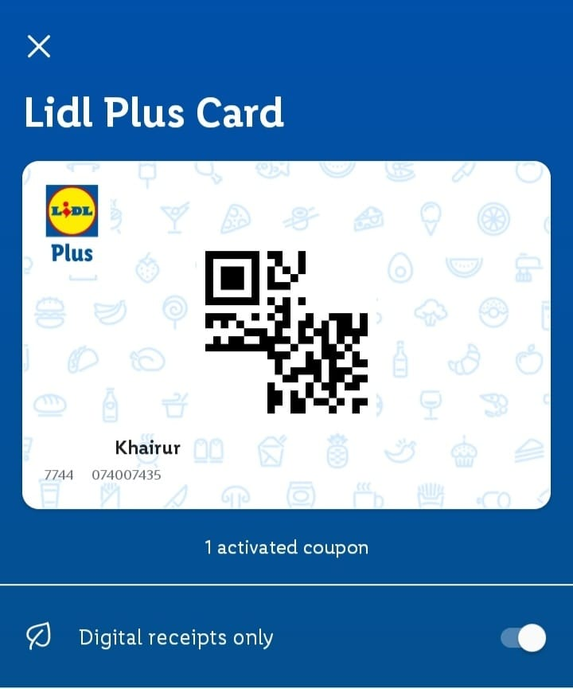
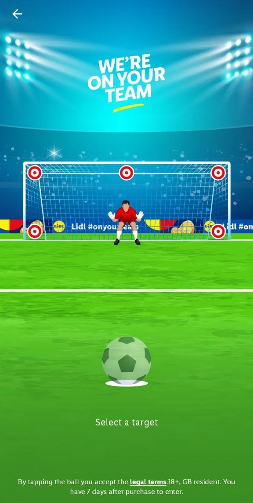
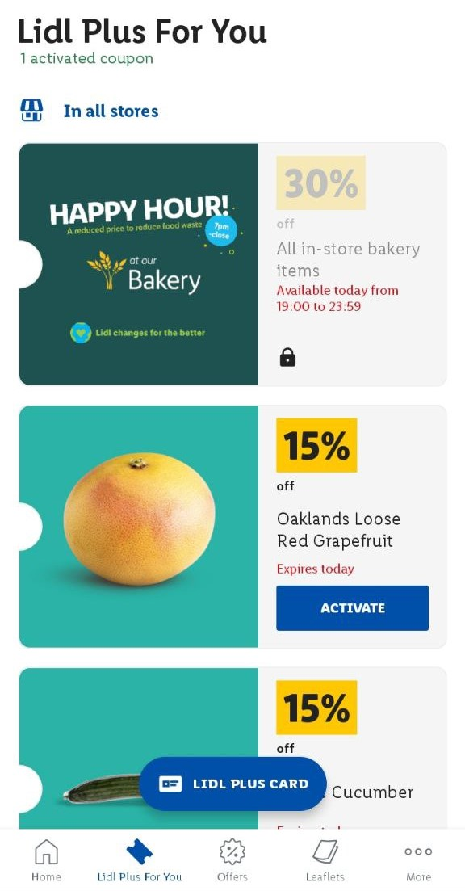
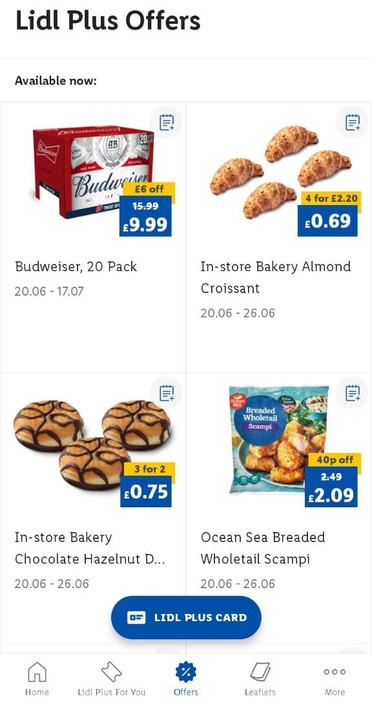
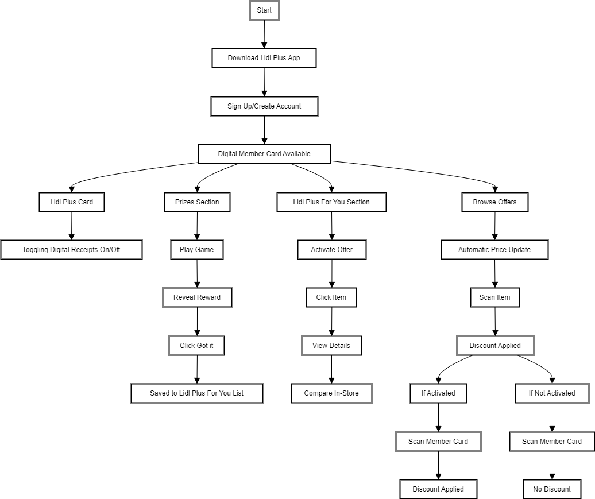

# Quick Start Guide: Lidl Plus App

## Introduction
Welcome to the Lidl Plus App! This guide will help you navigate through the app’s features, from signing up to using digital coupons and participating in fun games for rewards.

## Table of Contents
- [Quick Start Guide: Lidl Plus App](#quick-start-guide-lidl-plus-app)
  - [Introduction](#introduction)
  - [Table of Contents](#table-of-contents)
  - [Signing Up and Accessing the Digital Member Card](#signing-up-and-accessing-the-digital-member-card)
    - [Steps to sign up:](#steps-to-sign-up)
  - [Managing Digital Receipts](#managing-digital-receipts)
    - [Steps to Toggle Digital Receipts:](#steps-to-toggle-digital-receipts)
  - [Playing Games for Discounts](#playing-games-for-discounts)
    - [Steps to Participate in Games:](#steps-to-participate-in-games)
  - [Using Coupons and Offers](#using-coupons-and-offers)
    - [To use the coupons and offers:](#to-use-the-coupons-and-offers)
  - [Checking Item Specifications](#checking-item-specifications)
    - [Steps to Check Item Details:](#steps-to-check-item-details)
  - [Understanding Catalog Offers](#understanding-catalog-offers)
    - [Steps for Catalog Offers:](#steps-for-catalog-offers)
  - [Flowchart](#flowchart)
    - [Flowchart Visualization](#flowchart-visualization)

## Signing Up and Accessing the Digital Member Card
### Steps to sign up:
1. Download the Lidl Plus App from the App Store or Google Play Store.
2. Open the app and sign up using your email address.
3. Once signed up, your digital membership card will be available within the app.

## Managing Digital Receipts

### Steps to Toggle Digital Receipts:
1. Click the "Lidl Plus Card" on Home page.
2. Toggle the “Digital receipts only” switch to enable or disable digital receipts.          

## Playing Games for Discounts

### Steps to Participate in Games:
1. Open the "Prizes" section on the Home page.
2. Play the game to reveal your reward (e.g., discount coupon or free item).
3. Tap "Got it" to save the reward to your offer list.         

## Using Coupons and Offers

### To use the coupons and offers:
1. Go to the "Lidl Plus For You" section in the footer of the app.
2. Activate the desired offer.
3. Ensure the offer is activated before checkout.
4. At checkout, scan your digital member card to apply the discount.       

## Checking Item Specifications
### Steps to Check Item Details:
1. In the "Lidl Plus For You" section, click on the item to view its details.
2. Compare the item specification with the product in-store to ensure it matches.

## Understanding Catalog Offers

### Steps for Catalog Offers:
1. Go to the “Offers” section in the footer of the app.
2. Browse the catalog to view current offers.
3. The prices in the catalog are automatically updated in the system.
4. Simply scan the item at checkout to receive the discounted price.      

## Flowchart
Here's a visual representation of the process for using the Lidl Plus App:

[Sign Up] --> [Download App] --> [Sign Up] --> [Digital Member Card Available]

[Managing Digital Receipts] --> [Lidl Plus Card] --> [Toggle Digital Receipts (On/Off)]

[Playing Games for Discounts] --> [Prizes Section] --> [Play Game] --> [Reveal Reward] --> [Click "Got it"] --> [Saved to Offer List]

[Using Coupons and Offers] --> [Lidl Plus For You Section] --> [Activate Offer]

If Activated --> [Scan Member Card] --> [Discount Applied]

If Not Activated --> [Scan Member Card] --> [No Discount]

[Checking Item Specifications] --> [Lidl Plus For You Section] --> [Click Item] --> [View Details] --> [Compare In-Store]

[Understanding Catalog Offers] --> [Browse Offers] --> [Automatic Price Update] --> [Scan Item] --> [Discount Applied]

### Flowchart Visualization
