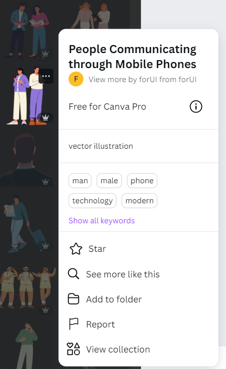
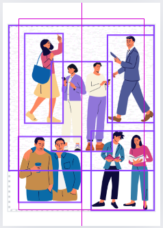
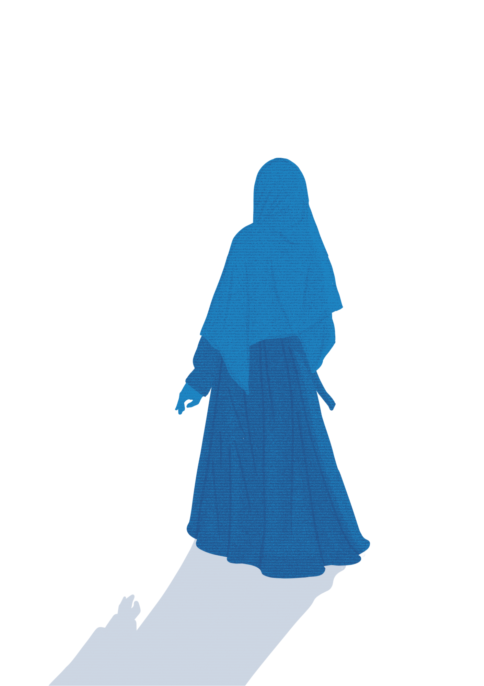
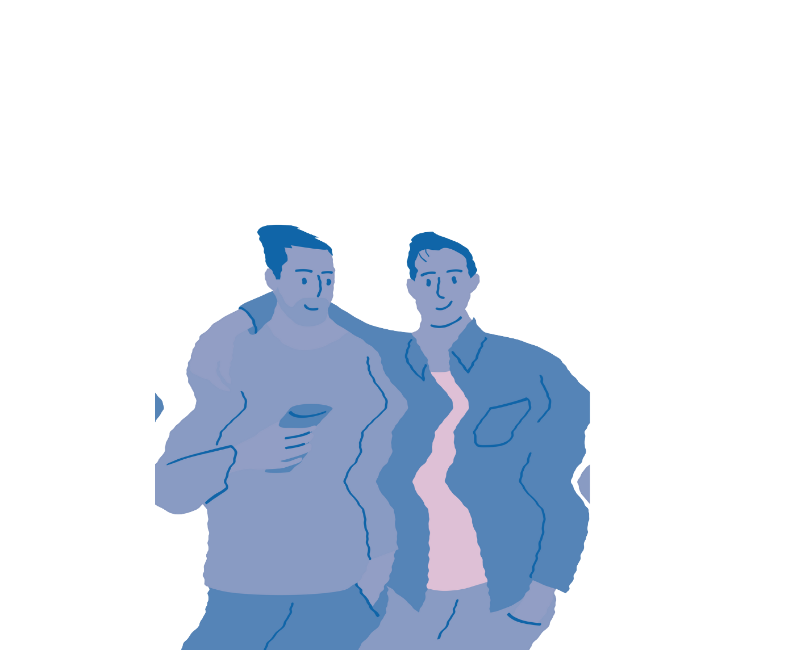
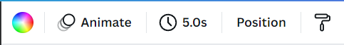
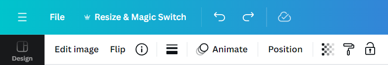

# Technical Writing Portfolio by Nurul Khairur

This portfolio includes examples of technical documentation written in Markdown.

<!-- toc -->

## Table of Contents

<ul>
  <li><a href="#header-1">Guides to Remaking My Postcard Design in Canva</a>
    <ul>
      <li><a href="#step-1">Step 1: Open Canva and Start a New Design</a></li>
      <li><a href="#step-2">Step 2: Choose a Template</a></li>
      <li><a href="#step-3">Step 3: Add and Position Elements</a></li>
      <li><a href="#step-4">Step 4: Apply Special Effects</a></li>
      <li><a href="#step-5">Step 5: Set the Background</a></li>
      <li><a href="#step-6">Step 6: Add Text</a></li>
      <li><a href="#step-7">Step 7: Final Adjustments and Save</a></li>
    </ul>
  </li>
</ul>

---

     

<h2 id="header-1" style="text-align: center;" align="center">Guides to Remaking My Postcard Design in Canva</h2>

Follow these steps to remake the postcard design using Canva. This guide will help you navigate the tools and options available to achieve a polished and visually appealing result.

<!-- Step 1 -->
<h4 id="step-1"><strong>Step 1: Open Canva and Start a New Design</strong></h4>

* **Log in to Canva**: Open Canva and log in to your account.  
* **Create a New Design**: Click on “Create a design” on the top dashboard and select “Postcard” from the drop-down menu. Alternatively, search for the preferred postcard size on the homepage. For this guide, we'll use the A5 size.  

<!-- Step 2 -->
<h4 id="step-2"><strong>Step 2: Choose a Template</strong></h4>

* **Start from Scratch**: Select a blank template to begin your design.  
  
<!-- Step 3 -->
<h4 id="step-3"><strong>Step 3: Add and Position Elements</strong></h4>

* **Search for Graphics**: In the side editor panel, click the Elements tab and use the search bar to find specific graphics. For example, search for “person walking” and click See all under Graphics for illustrations or Photos for real images.  

    

      <strong>Remove Background (Optional)</strong>:  
      If you choose an image with a background, click on the image.  
      Click "Edit image" and select "Background Remover" under the Magic Studio section.  
      This tool will remove the background, leaving only the character image.    
      
    

  <strong>Maintain Consistency:</strong>     

  When you find an element you like in Graphics or Photos, click the three dots (...).
    
  Choose "See more like this" or "View Collection" to find similar styles.
  
  This is to ensure a consistent style across your design. 

   

* **Position Element**: Click and drag elements to arrange them on the canvas. For layering, right-click on an element and choose "Layer," then select whether to bring it forward or send it backward. This process helps in visualizing and refining the overall concept.  

* **Customize Colors**: Select an element, click "Edit image," choose "Duotone" under the Effects section, and select "Lavender" or any other color that matches your theme. Apply this to each element as needed.  

<!-- Step 4 -->
<h4 id="step-4"><strong>Step 4: Apply Special Effects</strong></h4>

* **Glitch Effect**: To apply a glitch effect to the main character image:  
  
    

    * Select the element.  

    * Click "Edit image," then select "BadTV" under the Apps section.  

    * Choose your preferred effect and adjust the sliders for thick and fine distort, scanline width, scanline amount, and static.  

    * Click "Save" to apply the effect.   

* **Liquify Effect**: To create a depth effect and highlight the main character:

    

  * Select the element.  

  * Click "Edit image," then choose "Liquify" under the Apps section.  

  * Select from five options, adjusting melt amount, melt scale, wobble amount, wobble scale, and smear using the sliders.  

  * Click "Save" to apply the effect.   

<!-- Step 5 -->
<h4 id="step-5"><strong>Step 5: Set the Background</strong></h4>

 

* **Choose Background Color**: Click on the canvas, then select the background color option from the header to choose a color that matches your theme.  
* **Add Texture**: Use the Elements tool to search for “Glitch TV effect.”  
* **Layer an Image Behind Other Elements**:
  * Find an image you like from Graphics or Photos.
  * Click on the image once it appears on your canvas.
  * Right-click and choose "Send to back" to position it behind other elements.
  * You can use the shortcut Ctrl+Alt+[ to send layers backward.
  
 

* **Adjusting Image Transparency**: Click on the image, then click on "Transparency" in the header to adjust the transparency of the background image. Ensure it doesn't distract from the main character or other focal elements.  

<!-- Step 6 -->
<h4 id="step-6"><strong>Step 6: Add Text</strong></h4>

* **Add Text Box**: Click on "Text" in the side menu, then click "Add a text box." The text box will appear on your canvas.  
* **Edit Text**: Double-click the text box to edit the wording. Choose a font from the dropdown menu on the header. For this guide, we use “Slackside One.”  
* **Apply Text Effects**:
  * Click "Effects" on the header to add effects to your text.  
  * Choose "Shadow" under the Style section and adjust Offset, Direction, Blur, and Transparency using the sliders.  
  * Select a color for the shadow that makes the text stand out.  
  * Scroll down and choose "Curve" to curve your text, adjusting the slider to get your preferred curve.  
* **Customize Colors**: Click the + button to add a new color if your preferred color isn't listed. Enter the color code for a specific shade and hit Enter.  
* **Position Text**: Click and drag the text box to position your text on the canvas. A dotted line will appear to help align elements horizontally and vertically.  
  
<!-- Step 7 -->
<h4 id="step-7"><strong>Step 7: Final Adjustments and Save</strong></h4>

* **Final Check**: Review the overall position of your elements and ensure everything is aligned correctly.  
* **Download Your Design**: Click the "Share" button on the dashboard at the top right. Select "Download," choose your file type (PDF, PNG, JPG), and click the "Download" button to save your design to your device.