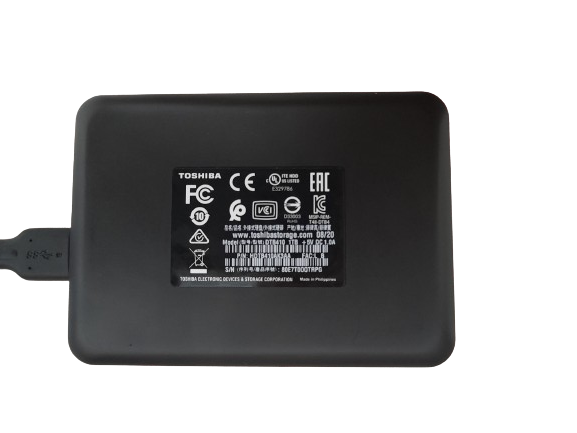

# Toshiba DTB410 1TB External Hard Drive User Manual for Windows

## Introduction
Congratulations on your purchase of the Toshiba DTB410 1TB External Hard Drive. This user manual is designed specifically for Windows users and will guide you through the setup, usage, and troubleshooting of your new external hard drive.

## Table of Contents
- [Toshiba DTB410 1TB External Hard Drive User Manual for Windows](#toshiba-dtb410-1tb-external-hard-drive-user-manual-for-windows)
  - [Introduction](#introduction)
  - [Table of Contents](#table-of-contents)
  - [Package Contents](#package-contents)
  - [Safety Precautions](#safety-precautions)
  - [Specifications](#specifications)
  - [System Requirements](#system-requirements)
  - [Setup Instructions](#setup-instructions)
    - [Step 1: Connect the Drive](#step-1-connect-the-drive)
    - [Step 2: Verify the Connection](#step-2-verify-the-connection)
    - [Step 3: Formatting the Drive (Optional)](#step-3-formatting-the-drive-optional)
  - [Usage Instructions](#usage-instructions)
    - [Storing Files](#storing-files)
    - [Backing Up Data](#backing-up-data)
    - [Ejecting the Drive Safely](#ejecting-the-drive-safely)
  - [Troubleshooting](#troubleshooting)
    - [Drive Not Recognized](#drive-not-recognized)
    - [Slow Performance](#slow-performance)
    - [Data Corruption](#data-corruption)
  - [Warranty and Support](#warranty-and-support)
  - [Conclusion](#conclusion)

  
  

## Package Contents
- Toshiba DTB410 1TB External Hard Drive
- USB 3.0 Cable
- User Manual
- Warranty Information

## Safety Precautions
- Do not expose the drive to water or moisture.
- Avoid dropping or physical shocks.
- Keep the drive away from direct sunlight or heat sources.
- Use only the provided USB cable.
- Do not attempt to open or modify the drive.

## Specifications
- **Model:** DTB410
- **Capacity:** 1TB
- **Power Supply:** +5V DC 1.0A (via USB)
- **Interface:** USB 3.0 (compatible with USB 2.0)
- **Dimensions:** 119 x 79 x 15 mm
- **Weight:** 230g

## System Requirements
- Windows 10/8/7
- Available USB 3.0 or USB 2.0 port

## Setup Instructions

### Step 1: Connect the Drive
1. **Unpack the Drive:** Remove the hard drive and USB cable from the packaging.
2. **Connect to Computer:**
   - Plug one end of the USB cable into the drive.
   - Plug the other end into an available USB port on your computer.
3. **Power On:** The drive is powered via the USB connection, so it will power on automatically when connected.

### Step 2: Verify the Connection
1. Open "File Explorer."
2. The drive should appear under "This PC" as a new drive letter.   

### Step 3: Formatting the Drive (Optional)
1. Right-click the drive in "File Explorer."
2. Select "Format."
3. Choose the desired file system (NTFS for Windows-only use, exFAT for cross-platform use).
4. Click "Start."

## Usage Instructions

### Storing Files
1. Drag and drop files from your computer to the external drive.
2. Create folders to organize your data.

### Backing Up Data
1. Use built-in backup utilities, such as Windows Backup.
2. Follow the software prompts to select the external drive as the backup destination.

### Ejecting the Drive Safely

1. Click the "Safely Remove Hardware and Eject Media" icon in the system tray.
2. Select the external drive and wait for the notification that it is safe to remove.    

## Troubleshooting

### Drive Not Recognized
- Ensure the USB cable is securely connected.
- Try a different USB port.
- Restart your computer.

### Slow Performance
- Connect to a USB 3.0 port for optimal speed.
- Ensure no other high-bandwidth devices are connected to the same hub.

### Data Corruption
- Always eject the drive safely.
- Regularly back up important data.

## Warranty and Support
- **Warranty:** This product comes with a one-year limited warranty.
- **Support:** For additional support, visit the Toshiba support website or contact customer service at [www.toshibastorage.com](https://www.toshibastorage.com).

## Conclusion
Thank you for choosing Toshiba. We hope you enjoy your new external hard drive. For further assistance, please refer to the support resources provided.
