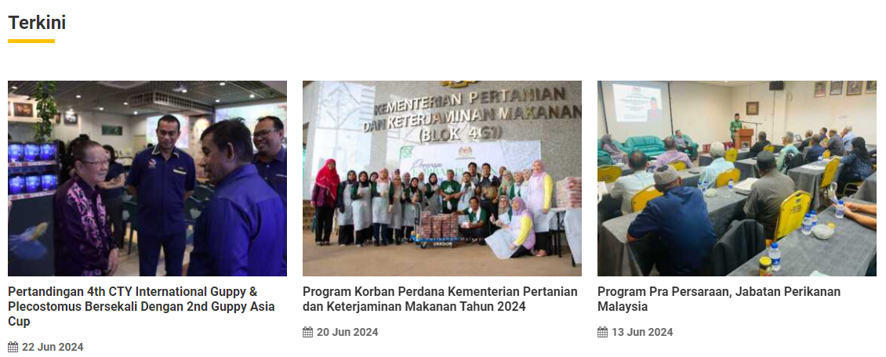

# Process Documentation: Content Publishing Workflow for the Department of Fisheries Malaysia Website
  

# Table of Contents

- [Process Documentation: Content Publishing Workflow for the Department of Fisheries Malaysia Website](#process-documentation-content-publishing-workflow-for-the-department-of-fisheries-malaysia-website)
- [Table of Contents](#table-of-contents)
  - [Introduction](#introduction)
  - [Process Overview](#process-overview)
    - [Step 1: Content Creation](#step-1-content-creation)
    - [Step 2: Content Review and Editing](#step-2-content-review-and-editing)
    - [Step 3: SEO Optimization](#step-3-seo-optimization)
    - [Step 4: Approval Process](#step-4-approval-process)
    - [Step 5: Publishing Content](#step-5-publishing-content)
    - [Step 6: Post-Publishing Review](#step-6-post-publishing-review)
  - [Conclusion](#conclusion)

## Introduction
This document outlines the standardized process for publishing content on the Department of Fisheries Malaysia’s official website using WordPress. The workflow ensures consistency, quality, and accuracy in all published content. By following these detailed steps, you can maintain a high-quality, professional web presence that aligns with the department’s standards.

## Process Overview

### Step 1: Content Creation

**Draft Creation:**
Authors create content drafts using the WordPress Gutenberg editor.

**Tone and Style:**
Ensure the content aligns with the department's tone (formal, informative) and style guidelines.
  

  
**Formatting:**
- **Headings:** Use H2 for main headings and H3 for subheadings.
- **Paragraphs:** Use short paragraphs for readability.
- **Thumbnails:** Insert images at 600px width and ensure they are optimized for web (compressed).
- **Metadata:** Add relevant categories, tags, and metadata such as meta descriptions and keywords.

**Image and Media Handling:**
- **Image Sizes:** Use images with a resolution of 72 DPI. Preferred formats are JPEG or PNG.
- **Alt Text:** Provide descriptive alt text for all images to enhance accessibility.
- **File Naming:** Use descriptive, keyword-rich file names for all media files.

### Step 2: Content Review and Editing

**Initial Review:**
Editors review the content drafts for accuracy, clarity, and compliance with department guidelines.

**Feedback:**
Use the built-in commenting system for feedback and revisions.

**Links:**
Ensure all links are functional and point to the correct URLs.

**Compliance Check:**
- **Guidelines:** Check the content against department-specific guidelines, such as branding and language use.
- **Consistency:** Ensure consistent use of terminology and formatting throughout the document.

### Step 3: SEO Optimization

**SEO Tools:**
Use the Yoast SEO plugin to optimize content for search engines.

**Focus Keywords:**
Add focus keywords to improve search engine ranking.

**Meta Descriptions:**
Write compelling meta descriptions that include focus keywords.

**Readability Scores:**
Ensure the content has good readability scores (e.g., Flesch Reading Ease).

**Content Structure:**
- **Headings:** Ensure proper use of H1 for titles, H2 for main sections, and H3 for subsections.
- **Alt Text:** Include keywords in the alt text for images.
- **Internal Linking:** Link to relevant internal pages to improve site navigation and SEO.

### Step 4: Approval Process

**Submission:**
Once reviewed and edited, the content is submitted for approval.

**Approval Levels:**
Designated approvers (e.g., department heads or ICT department teams) review the final draft.

**Revision Requests:**
Address any feedback or requests for changes from approvers.

**Approval Status:**
Approved content is marked as ready for publishing in the WordPress dashboard.

### Step 5: Publishing Content

**Scheduling:**
Approved content is scheduled or immediately published based on the content calendar.

**Formatting Check:**
Verify that the content appears correctly on the live site, including formatting and media display.

**Social Media Sharing:**
Share the published content on the department’s social media channels and newsletters.

### Step 6: Post-Publishing Review

**Monitoring:**
Monitor the published content for any issues or feedback.

**Engagement:**
Respond to comments and engage with readers.

**Performance Analysis:**
Use analytics tools (e.g., Google Analytics) to track content performance and gather insights for future content.

**Updates and Maintenance:**
- Regularly update content to keep it current and relevant.
- **Broken Links:** Periodically check and fix any broken links.
- **Content Refresh:** Update outdated information and improve SEO as needed.

## Conclusion
This content publishing workflow ensures that all materials on the Department of Fisheries Malaysia’s website are accurate, well-structured, and aligned with the department’s standards. Following this process will help maintain a high-quality and professional web presence.
